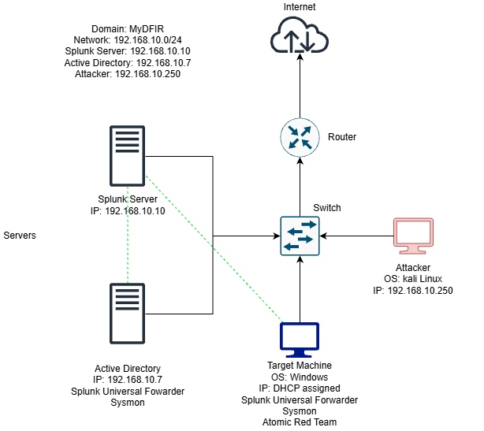
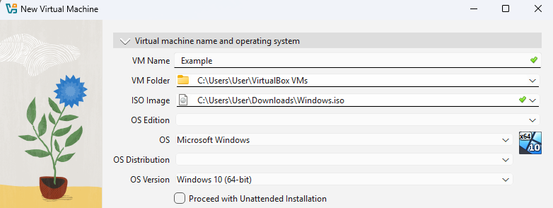
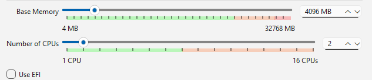
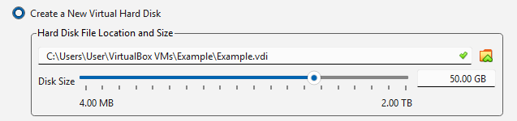
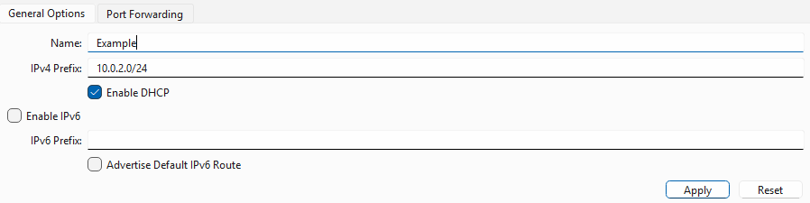
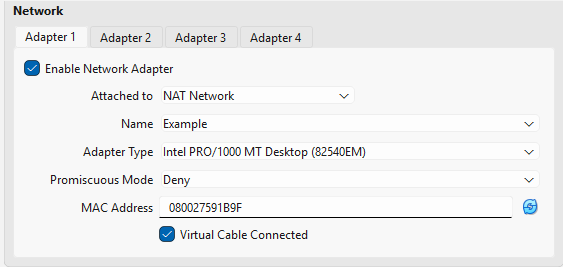

# Active-Directory-Home-Lab

## Overview
In this project, I aim to document setting up a hom lab using virtual machines.  Then I will perform attacks on the servers and also learn to anaylse/monitor attacks using seim tools.  I will also document my learning of how the vulnerabilities are exploited, and how to spot the attacks in the seim tool.

Credits to Youtuber MyDFIR, this project mostly followed his tutorial Active Directory Project(Home Lab) to set up this project.\
You can find his series following this link:
[Active Directory Project(Home Lab)](https://www.youtube.com/playlist?list=PLGrcVHQv6mp-_5jY1XU1SJ3tjoUMrTI7E)

### Technologies
OS: Windows 10, Kali Linux, Windows Server 2022, Ubuntu Server 22.04.5\
Hypervisor: Virtual Box\
Tools: Sysmon, Splunk
### Learning Objectives
- [x] Learning how to create, configure, and manage VMs using a hypervisor
- [ ] Learning how to configure and manage an Active Directory server
- [ ] Learning how to configure and manage a Splunk server (Ubuntu Server)
### Network Design
 

 

## Set-up
### Creating and Configuring VMs
In this project, I used Virtual Box as my hypervisor to host my VMs.\
 

#### Steps for hosting a VM in Virtual Box:
1. Prepare an ISO file of the OS you want to run
1. Press "New"
1. Name the machine, and select the ISO file to boot from ( check 'Skip Unattended Installation' if you want to manually run through the OS setup wizard )\
    
1. Set the amount of memory (RAM), numbers of maximum CPU used, and amount of virtual hard disk space to allocate to the VM\
    
    
1. Spin up the VM and install the desired OS 
 
 

#### Setting up NAT Network Subnet:
*It is important to use a NAT Network subnet to allow the VMs to discover and communicate with each other, while keeping them isolated from the home network
1. On the left sidebar, select Network
1. Select NAT Networks and click create
1. Name the network, enter the IPv4 prefix (or IPv6, but in this project, IPv4 is used), and choose to enable DHCP or not.  After finished, click apply\
    
1. Go back to the machines page, and for each machine, do the following steps
1. For the "attached to" select NAT Network, and for the "name", select the name you have created.\
    

### Setting up Splunk Server
Setting up a staic IP:
 
 
*While I was following the tutorial, I found that in my setup, there is no "00-installer-config.yaml" file. Instead there is a "50-cloud-init.yaml" file in where that file should be.\
After researching, I found out that it is due to the cloud-init package that modern ubuntu deafultly includes in their ISO files.  In my lab enviroment, it would overwrite my netplan settings on every reboot and convert it back to DHCP(dynamic IP).  To work around this, I researched that I have to disable cloud-init's netplan management so it does not actively overwrite the "50-cloud-init.yaml" on reboot, and then write the correct network information into the file.

*during further research, I found out it is best practice to delete the "50-cloud-init.yaml" file and write a new netplan file to ensure clarity

1.
