# Active-Directory-Home-Lab

## Overview
In this project, I aim to document setting up a hom lab using virtual machines.  Then I will perform attacks on the servers and also learn to anaylse/monitor attacks using seim tools.  I will also document my learning of how the vulnerabilities are exploited, and how to spot the attacks in the seim tool.

Credits to Youtuber MyDFIR, this project mostly followed his tutorial Active Directory Project(Home Lab) to set up this project.\
You can find his series following this link:
[Active Directory Project(Home Lab)](https://www.youtube.com/playlist?list=PLGrcVHQv6mp-_5jY1XU1SJ3tjoUMrTI7E)

### Technologies
OS: Windows 10, Kali Linux, Windows Server 2022, Ubuntu Server 22.04.5\
Hypervisor: Virtual Box\
Tools: Sysmon, Splunk
### Learning Objectives
- [x] Learning how to create, configure, and manage VMs using a hypervisor
- [x] Learning how to configure and manage an Active Directory server
- [x] Learning how to configure and manage a Splunk server (Ubuntu Server)
- [ ] Test different vulnerabilites and how to spot them in a SIEM tool
    - [X] brute force attack
### Network Design
 
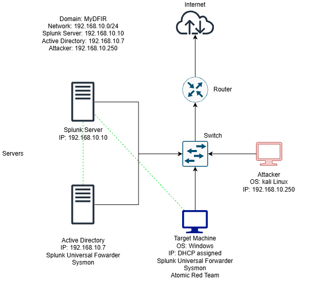
 

## Set-up
### Creating and Configuring VMs
In this project, I used Virtual Box as my hypervisor to host my VMs.\

#### Steps for hosting a VM in Virtual Box:
1. Prepare an ISO file of the OS you want to run
1. Press "New"
1. Name the machine, and select the ISO file to boot from ( check 'Skip Unattended Installation' if you want to manually run through the OS setup wizard )\
    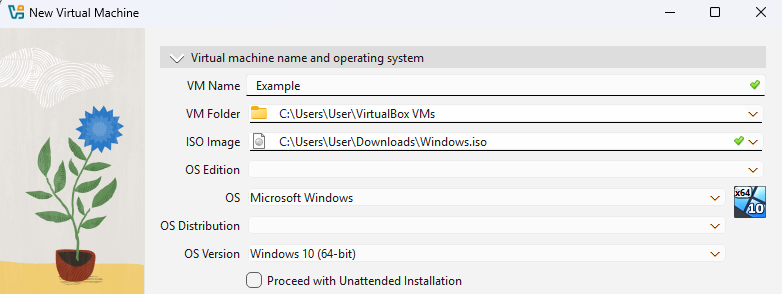
1. Set the amount of memory (RAM), numbers of maximum CPU used, and amount of virtual hard disk space to allocate to the VM\
    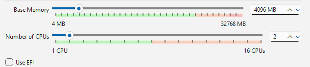
    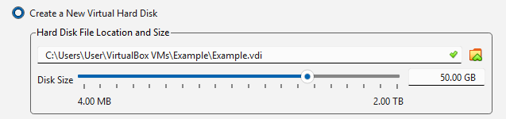
1. Spin up the VM and install the desired OS 

#### Setting up NAT Network Subnet:
*It is important to use a NAT Network subnet to allow the VMs to discover and communicate with each other, while keeping them isolated from the home network
1. On the left sidebar, select Network
1. Select NAT Networks and click create
1. Name the network, enter the IPv4 prefix (or IPv6, but in this project, IPv4 is used), and choose to enable DHCP or not.  After finished, click apply\
    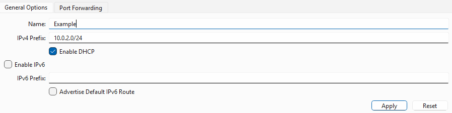
1. Go back to the machines page, and for each machine, do the following steps
1. For the "attached to" select NAT Network, and for the "name", select the name you have created.\
    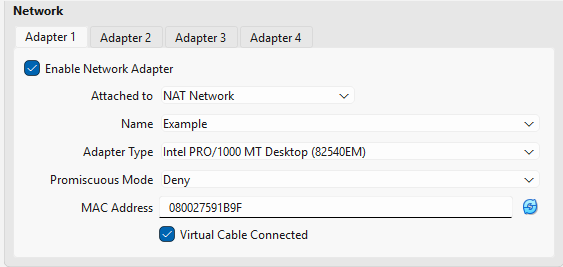
 
 

### Setting up Splunk Server
#### Setting up a staic IP:

*While I was following the tutorial, I found that in my setup, there is no "00-installer-config.yaml" file. Instead there is a "50-cloud-init.yaml" file in where that file should be.\
After researching, I found out that it is due to the cloud-init package that modern ubuntu includes in their ISO files by default.  In my lab enviroment, it would overwrite my netplan settings on every reboot and convert it back to DHCP(dynamic IP).  To work around this, I researched that I have to disable cloud-init's netplan management so it does not actively overwrite the "50-cloud-init.yaml" on reboot, and then write the correct network information into the file.\
You can read more about cloud-init in the [official documentation](https://docs.cloud-init.io/en/latest/)

*During further research, I found out it might be better practice to delete the "50-cloud-init.yaml" file and write a new netplan file to ensure clarity

1. In bash, use the following command to create a configuration file that disables the network management of the cloud-init package:\
    *sudo nano /etc/cloud/cloud.cfg.d/99-disable-network-config.cfg*
1. In nano, add the following line to the file, then save and exit (ctrl+o, ctrl+x):\
    *network: {config: disabled}*
1. In bash, use the following command to delete the "50-cloud-init.yaml" file:\
    *sudo rm /etc/netplan/50-cloud-init.yaml*
1. In bash, use the following command to create a new netplan configuration file:\
    *sudo nano /etc/netplan/x-file-name.yaml*
1. In nano, edit the file to fit the following structure(replace the "addresses" and "default" with the desired IP addresses), then save and exit:\
    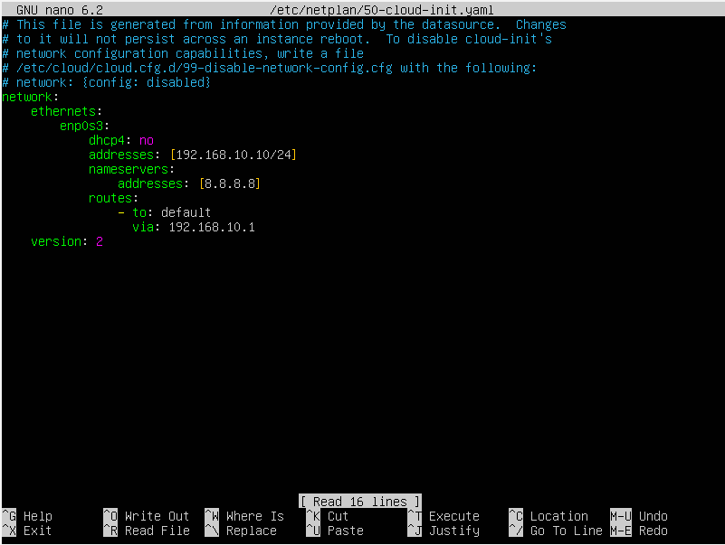
1. In bash, use the following commands to apply the netplan configuration:\
    *sudo netplan try*\
    *sudo netplan apply*
1. In bash, use *ip a* to confirm the static ip is applied and use *ping* to confirm connection is working 

#### Setting up a shared directory on the VM

*You need to setup a shared directory to load the splunk .deb file into the VM

1. Create a directory for the VM in the host machine
1. In bash, use the following commands to install the Guest Additions:\
    *this enables native shared folders(vboxsf) for the VM, and also other functionalities, learn more in the [official documentation](https://www.virtualbox.org/manual/ch04.html)\
    *sudo apt-get install virtualbox-guest-additions-iso*\
    *sudo apt-get install virtualbox-guest-utils*
1. In bash, use the following command to reboot the VM to apply the changes:\
    *sudo reboot*
1. In bash, use the following command to add youself to the vboxsf group:\
    *sudo adduser [your username] vboxsf*
1. In bash, use the following command to make a new directory called share:\
    *mkdir share*
1. In bash, use the following command to mount the created directory(host) to the VM share folder:\
    *sudo mount -t vboxsf -o uid=1000,gid=1000 [your directory name] share/*

#### Installing Splunk
1. Register an account on the Splunk website, and download the Enterprise Linux .deb file to the shared folder
1. In bash, cd into the folder and cd into /opt/splunk
1. In bash, use the following command to Change into the "splunk" user:\
    *sudo -u splunk bash*
1. In bash, cd into the bin directory and us the following binary to start the install:\
    *./splunk start*
1. After installation is complete, use *exit* to exit the "splunk" user bash.
1. In bash, cd into bin and use the following command to make splunk automatically run on boot as user "splunk":\
    *sudo ./splunk enable boot-start -user splunk*

### Setting up Splunk Universal Fowarder and Sysmon:
*Do this for both the target machine and the AD server

#### Setting static ip on the AD server:
1. Open network and intenet setting and click into change adapter options
1. Right-click the ethernet and open properties
1. Double click the TCP/IPv4 and change the settings to match the following image (replace information to match your designed network):\
    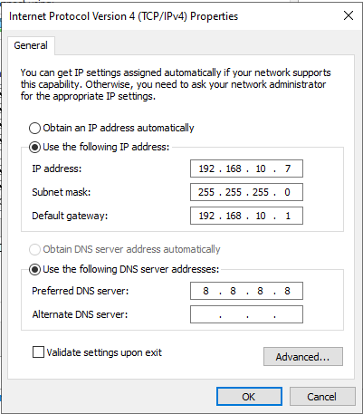
1. Click ok to apply changes, in the CMD, use *ipconfig* to check it has been appplied
    
#### Sysmon:
1. Download sysmon zip from microsoft and extract the files
1. Download sysmonconfig.xml from [olafhartong's repo](https://github.com/olafhartong/sysmon-modular)\
    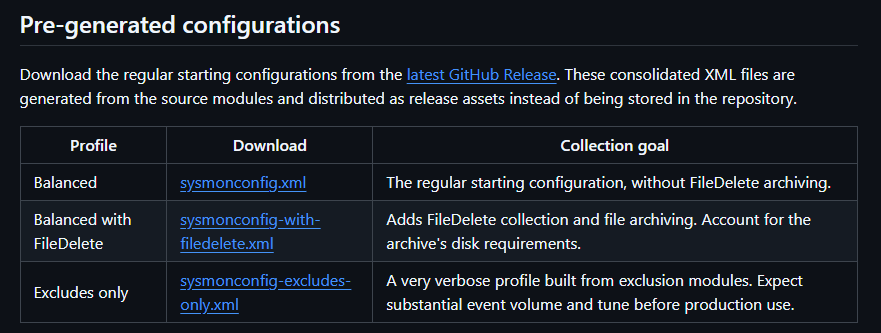\
    *from my understanding, this can help filter noise for sysmon while flagging high-risk behaviour, there are other configs but Olaf's is the most popular one
1. Open an admin elevated powershell
1. CD into where the file is extracted
1. In powershell, use the following command to install sysmon:\
    *[path]\Sysmon64.exe -i [path]\sysmonconfig.xml*

#### Splunk Universal Fowarder:
1. Download and start the Splunk Universal Fowarder installer
1. Accept the license agreement and select an on-premise Splunk Enterprise instance
1. Choose your username and keep the generate random password checked
1. Press next to skip the deployment server, enter the Splunk server ip into the receiving indexer, and use the default port 9997
1. Click install
1. Configure the inputs.conf by creating a new one in C:\Program Files\SplunkUniversalForwarder\etc\system\local \
    The way to do this is to open an admin elevated notepad, copy the content of the file in the inputs.conf in resources, and save it to the destination naming it inputs.conf
1. Open an admin elevated services, search for SplunkForwarder
1. Double click the service and in the Log On tab, check the Local System account box and click apply\
    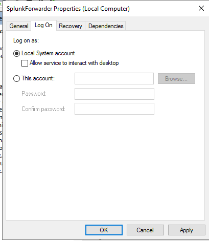
1. Restart the SplunkForwarder service

#### Configure Splunk:
1. In a browser, open [splunk server ip]:8000, and login
1. in settings, go to indexes
1. Click new indexes and create a new index called "endpoint" and save it\
    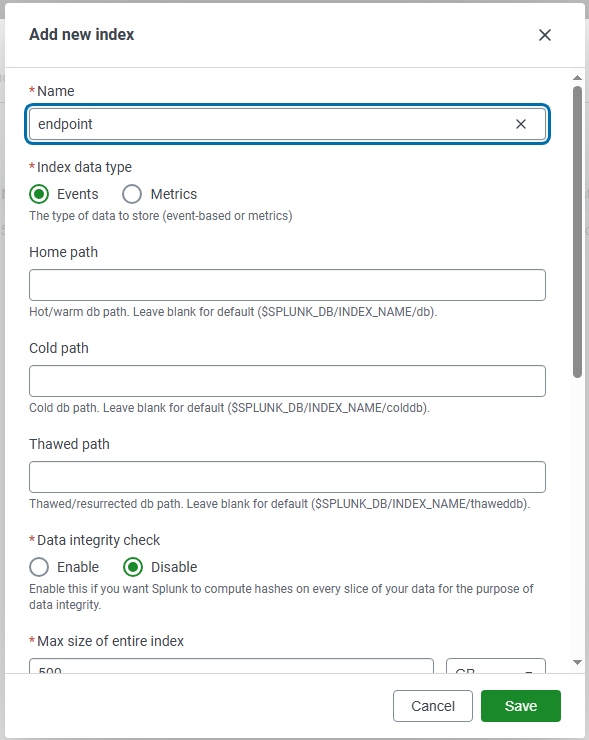
1. In settings, go to fowarding and receiving, and click on configure receiving
1. Click on new recieving port, enter 9997, and click save
1. Click on the splunk logo, then click into search and reporting
1. In the search bar, type index="endpoint" and search, check that the new hosts exists and that the source match with the inputs.conf file
 
 

### Configuring Active Directory:
#### The DC
1. On the windows server, go into server manager
1. Under manage, select add roles and features
1. For installation type, select role-based feature-based installation
1. For server roles, tick the Active Directory Domain Services and click add features
1. Leave everything else as default and install
1. After the installation is finished, return to the homescreen and you should see a flag sign on the top right bar, click on that and click on promote this server to a domain controller
1. Select add a new forest, for the root domain name, it must follow the format:\
    [name]+.[*] (e.g. mylab.local)
1. Put in a password, and continue until the install button is available and click that
1. After installation, you should be prompted to restart

#### Managing a domain
In server manager, click on tools and select active direcort users and computers.\
Inside the domain you created, you can see the built in containers that there by deafault, these are usually untempered with in a practical enviroment.  You cannot link a GPO to a default container.\
Instead, it is common practice to add users, devices to organizational units.

#### Adding an organisational unit
1. Right-click on the domain, click new and select organizational unit

#### Adding a user
1. Right-click on an organizational unit, click new and select user
1. Set up the user's name, logon name and password

#### Joining a domain
1. Go to network settings, change adapter options, IPv4, and change the preferred DNS server to point to the AD server\
    *note: this will cause the machine to be stop querying google DNS directly, so you cannot visit website using URLs unless DNS Forwarding is enabled on the AD server. 
1. In the target machine, go to about this pc, and advanced system settings
1. Go to the computer name tab, click change
1. Tick the Domain tickbox, enter the name of the root domain and click ok
1. Restart the VM, now you can use the logon name and password you set to log into a user account

### Snapshot the machines
1. Click onto you machine
1. Go onto the snapshots tab nex to the details tab
1. Click take on the top bar