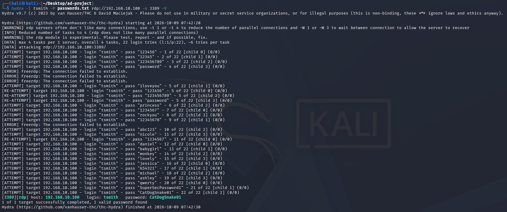
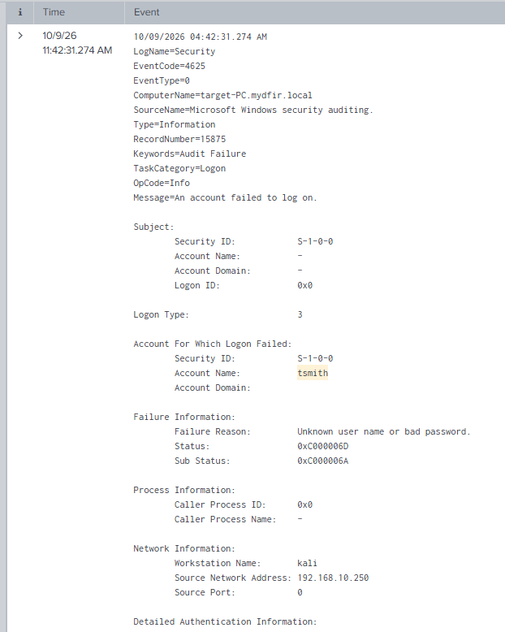

# Record of Brute Force Attack

## The attack

On my kali VM, I intended to use Crowbar to run the first 20 lines of rockyou.txt + the known password as a simulation of a brute force/dict attack.

For this attack, it relies on RDP(Remote Desktop Protocol) to connect to the target machine, so remote desktop must be enabled.

1. I output the first 20 lines of the built in rockyou.txt to a new txt file and use nano to add the known password to form an password dictionary.\
    *sudo gunzip rockyou.txt.gz*\
    *cp rockyou.txt [destination]*\
    *head -n 20 rockyou.txt > password.txt* (at destination)\
    *nano password.txt*

1. *crowbar -b rdp -u [target account username] -C [password dictionary] -s [targer ip]/32*

    *This was the tutorial's intended way of attacking, however it doesn't seem to work and only returns  "No results".\
    I tried adding the domain on the target username, turning off only allowing NLA connections, still returning no results.\
    I asked AI and used the xfreerdp to connect to desktop remotely, which proved that the information I was trying to use on the attack was not wrong.  I was also getting no records of attempts of login on splunk.\
    At this point, I could only assume there is some issue with using crowbar that I cannot connect through RDP.\
    I did some reseach and decided to switch to using hydra.

1. *hydra -l [target account username] -P [password dictionary] rdp://[target ip] -s 3389 -V*

    

1. So if a brute-force attack is successful, you can see that hydra would display the host IP, the username, and the password that was successful.

## Detection

1. On Splunk, go to search and reporting
1. In the seachbar, type in index="endpoint" and the username of the suspected breached account, and set the time range to the time period you suspect the account is breached
1. In the event of a brute-force attack, a large amount of events, where the Event Code is 4625 should be spotted.  These are failed login attempts, the failiure reason should read "Unknown user name or bad password.".  It should also show the source IP adress of the attacker, in my case my kali's IP address.
    

